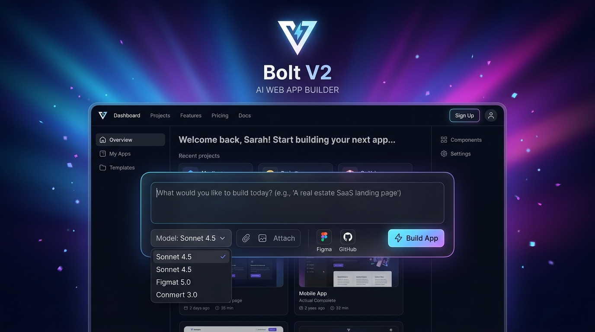
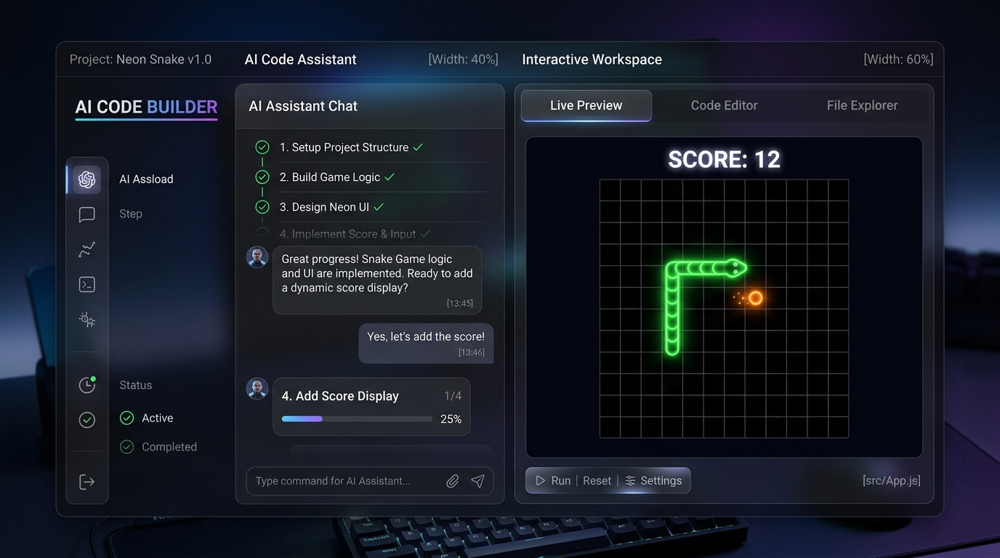
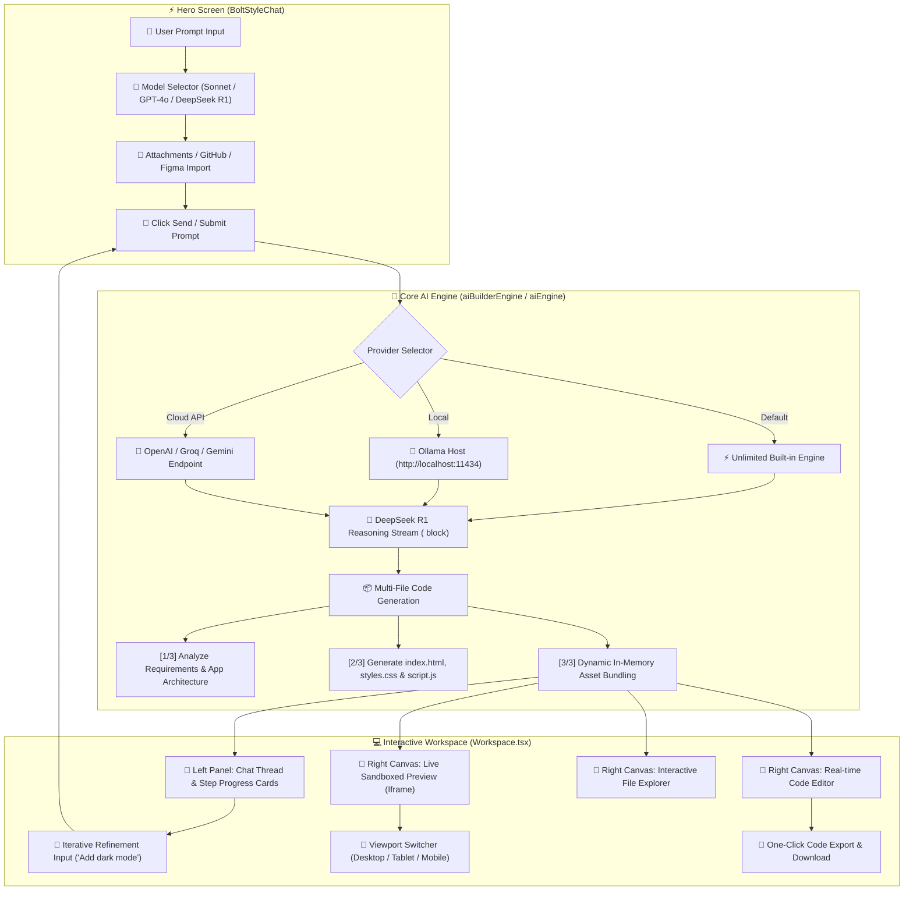

# ⚡ mlh project 1 - Bolt V2 AI Web Application Builder & ChatGPT Unlimited

A next-generation, full-stack AI Web Application Builder and ChatGPT interface built with **React**, **TypeScript**, **Tailwind CSS**, and **Vite**. Features an interactive Live Preview canvas, real-time code editor, responsive device switcher, file explorer, and zero-subscription unlimited AI generation.


---

## 📸 Interface & Workspace Screenshots

### 1. Bolt V2 Hero & Model Selector Interface


### 2. Interactive Workspace, Live Code Preview & AI Assistant


---

## 📊 Project Flowchart & System Architecture (MLH Project 2)

### 1. High-Level System Flow Diagram (Mermaid)



---

### 2. Detailed ASCII Data & Execution Flowchart

```text
===================================================================================
                       MLH PROJECT 2 - COMPLETE EXECUTION FLOW
===================================================================================

[ USER INTERFACE ]
  │
  ├─ 1. Home Screen (BoltStyleChat.tsx)
  │    ├── Custom Geometric V Logo & Ray Gradient Background
  │    ├── Model Dropdown: Sonnet 4.5 | Opus 4.5 | Haiku 4.5 | GPT-4o | Gemini 2.0
  │    ├── File Attachments (.txt, .md, .js, .py, .html, .csv)
  │    └── Submit Button ➔ User prompt: "Build a Snake Game"
  │
[ AI PROCESSING PIPELINE ]
  │
  ├─ 2. AI Router (aiBuilderEngine.ts / aiEngine.js)
  │    ├── Check Config: Provider (Built-in / Ollama / OpenAI / Groq)
  │    ├── If DeepSeek R1 selected ➔ Stream <think> step-by-step reasoning thoughts
  │    └── Stream real-time progress steps:
  │         [✓] Step 1: Analyzing requirements & designing app structure
  │         [✓] Step 2: Generating HTML, CSS & JavaScript modules
  │         [✓] Step 3: Compiling assets & initializing preview environment
  │
[ DYNAMIC ASSET BUNDLER ]
  │
  ├─ 3. In-Memory Code Assembler
  │    ├── Constructs index.html (DOM structure)
  │    ├── Injects styles.css into <style> head
  │    └── Injects script.js into <script> footer
  │
[ LIVE CANVAS WORKSPACE ]
  │
  ├─ 4. Interactive Workspace (Workspace.tsx)
  │    ├── LEFT PANEL:
  │    │    ├── Message thread history & AI response
  │    │    ├── Step-by-step progress cards
  │    │    └── Iterative prompt box (Refine app: "Add high score board")
  │    │
  │    └── RIGHT PANEL (Canvas Drawer):
  │         ├── 📱 Live Preview (Sandboxed <iframe> via srcDoc)
  │         ├── 💻 Code Editor (Live text editor with real-time preview re-bundle)
  │         ├── 📁 File Explorer (Directory grid of project files)
  │         ├── 📱 Device Viewport Toggle (Desktop / Tablet / Mobile)
  │         └── 💾 Code Export (One-click project download)
  │
===================================================================================
```

---

## 🌟 Key Features & Capabilities

### 🚀 1. Bolt V2 Hero & UI
- **Ambient Ray Background**: Futuristic gradient backdrop with custom geometric V logo emblem.
- **Model Selector**: Switch between **Sonnet 4.5**, **Opus 4.5**, **Haiku 4.5**, **GPT-4o**, and **Gemini 2.0**.
- **Attachment & Import Shortcuts**: Upload code files, attach images, or import from **GitHub** and **Figma**.

### 💻 2. Live Workspace & Code Canvas
- **Live Sandboxed Preview**: Test generated HTML5/CSS3/JavaScript applications inside an embedded, isolated `<iframe>`.
- **Real-Time Code Editor**: Editable text workspace with language tags that updates the live preview automatically.
- **Interactive File Explorer**: Directory tree showing all generated files (`index.html`, `styles.css`, `script.js`).
- **Responsive Viewports**: Switch between **Desktop**, **Tablet**, and **Mobile** preview dimensions.
- **One-Click Code Export**: Download all generated project source files directly to your machine.

### 🧠 3. Core AI Engine & DeepSeek Reasoning
- **Unlimited Token Output**: Zero token caps, zero rate throttling, and zero subscription costs.
- **DeepSeek R1 `<think>` Block**: Expandable step-by-step thinking process display.
- **Voice Dictation & Audio Reader**: Speech-to-text input dictation and text-to-speech response reader.
- **Web Search Mode**: Synthesizes real-time online search insights into responses.

---

## 🛠️ Project Directory Structure

```text
mlh project 2/
├── docs/
│   └── images/
│       ├── bolt_hero_screen.jpg         # Hero screen interface screenshot
│       └── workspace_live_preview.jpg   # Interactive workspace canvas screenshot
├── components/
│   └── ui/
│       └── bolt-style-chat.tsx          # Hero section with prompt input & V logo
├── lib/
│   └── utils.ts                         # Shadcn UI utility helper (cn)
├── src/
│   ├── components/
│   │   └── Workspace.tsx                # Live Canvas, Code Editor, Preview iframe
│   ├── services/
│   │   └── aiBuilderEngine.ts           # Real-time project code streaming engine
│   ├── App.tsx                          # App router switching between Hero & Workspace
│   ├── main.tsx                         # React entry point
│   ├── index.css                        # Tailwind CSS v4 directives & theme tokens
│   └── types.ts                         # TypeScript interfaces
├── .env                                 # API Key & environment configuration
├── aiEngine.js                          # Standalone streaming AI core engine
├── components.json                      # Shadcn UI configuration
├── package.json                         # Dependencies & scripts
├── postcss.config.js                    # PostCSS configuration
├── tailwind.config.js                   # Tailwind CSS configuration
├── tsconfig.json                        # TypeScript path alias configuration (@/*)
└── vite.config.ts                       # Vite configuration
```

---

## 🚀 Getting Started

### 1. Prerequisites
Ensure you have **Node.js** (v18+) installed.

### 2. Installation
```bash
npm install
```

### 3. Development Server
Start the Vite development server:
```bash
npx vite --port 3000 --host
```
Open **[http://localhost:3000/](http://localhost:3000/)** in your browser.

### 4. Build for Production
```bash
npx vite build
```

---

## 🔑 Environment Configuration

Configure your default API Key in the `.env` file at the root directory:

```env
VITE_AI_API_KEY=your_api_key_here
VITE_AI_PROVIDER=custom
```

---

## 📜 License

Distributed under the MIT License.
